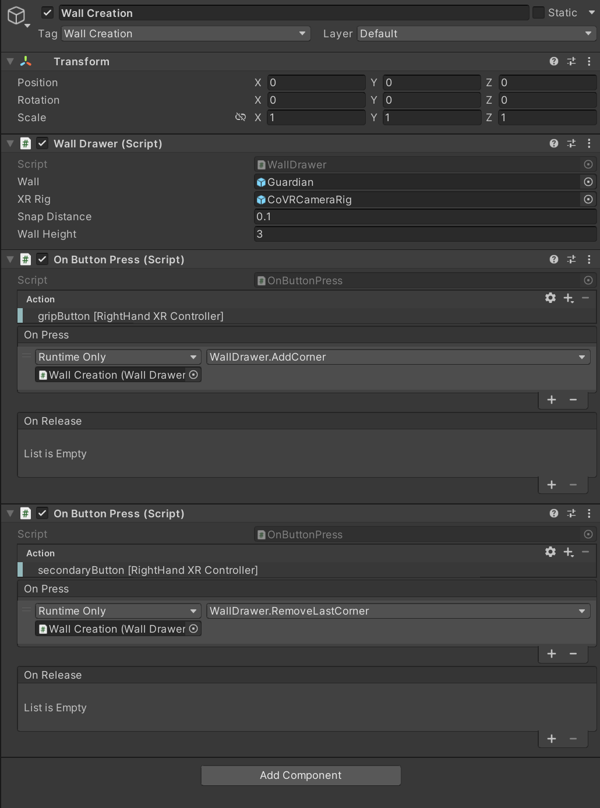
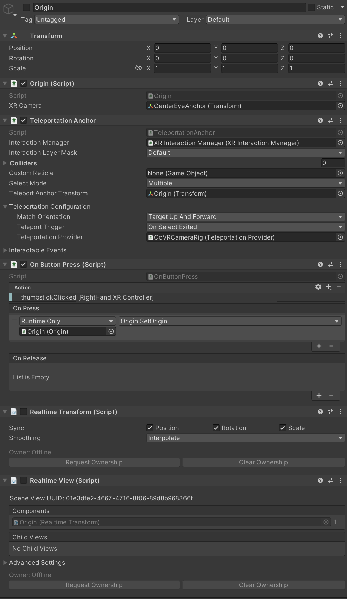
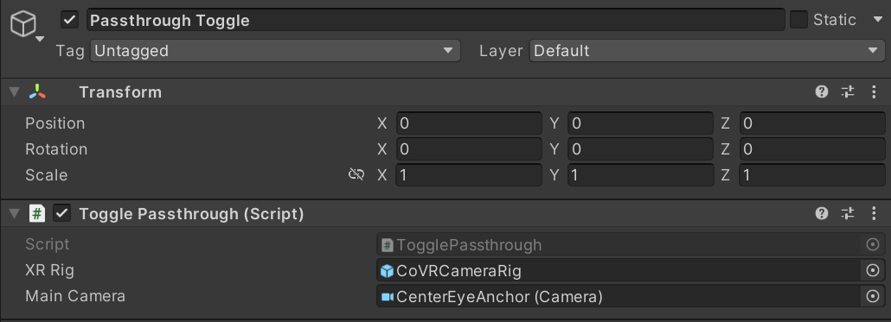
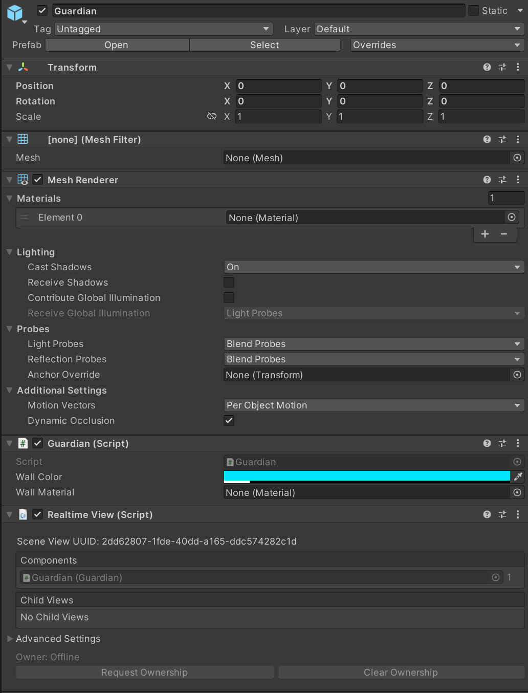

# Co-VR
Co-Located Virtual Reality, or Co-VR, centers around creating VR experiences that map players in the same physical and virtual space. Players can interact and see each other in the same virtual world while only being feet apart. We created this Unity package and associated documentation to help other Unity VR developers create Co-Located Experiences in Virtual Reality. We hope this tool will help add more exciting and groundbreaking VR experiences to the community.

## Installation

> Follow these directions carefully, as an incorrect setup may result in unexpected behavior or an unusable co-location setup.

### Import the Co-VR Package

> Note: DO NOT import the Co-VR package until making sure you have ALL the dependency packages imported properly. Co-location will not work otherwise.

The following list details packages that Co-VR is dependent upon. All packages can be found on the Unity Asset Store or are imported into a project by default: 

| Name                                | Version  |
|-------------------------------------|----------|
| com.normalvr.normcore               | 2.4.1    |
| com.unity.xr.oculus                 | 3.2.2    |
| com.unity.xr.openxr                 | 1.5.3    |
| com.unity.textmeshpro               | 3.0.6    |
| com.unity.ugui                      | 1.0.0    |
| com.unity.xr.interaction.toolkit    | 2.0.4    |
| com.unity.xr.management             | 4.2.1    |
| com.unity.test-framework            | 1.1.31   |
| com.unity.timeline                  | 1.6.4    |
| Oculus Integration                  | 50.0   |

Once the dependencies have been imported, do the following:

1. Search for Co-VR on the Unity Asset Store and add it to your assets.
2. In an open project in Unity Editor, open *Package Manager* by selecting **Window > Package Manager**.
3. On the **Packages: My Assets** tab at the top of the Package Manager, select the Co-VR package and click **Download** in the bottom right.
4. After the download is complete, click the **Import** button that appears next to the **Download** button.
5. When a pop-up window appears, click the **All** button and then the **Import** button in the pop-up window.

Once the package is imported into the project, you will need to move some files around.

- Move `CoVRCameraRig.prefab` and `Guardian.prefab` into the `Assets/Resources` folder.

Next, you will create the GameObjects necessary for co-location to work in your project.

------

### Create Necessary GameObjects

Several GameObjects are necessary for co-location to work. We will first go through the GameObjects not involving proprietary software or components, then discuss GameObjects involving proprietary software.

> Note: Component settings marked with an asterisk (*) are recommended settings. These settings are not required for co-location to work, but are recommended for the best experience. However, they need to be specified in order for the GameObject to work properly.

#### Non-Proprietary GameObjects

##### Wall Creation

Since Meta Quest does not allow for transmission of the native Guardian boundary to other headsets (and also has a hard limit of 15 m x 15 m area), this package opts for disabling the native Guardian boundary and creating a new one using a procedural mesh system. 
> Note: the native Guardian boundary on the Meta Quest does not have to be disabled if the desired play area is less than 15 m x 15 m.

**Components:**
- [Wall Drawer (Script)](src/WallDrawer.md)
    - Wall: Guardian.prefab
    - XR Rig: CoVRCameraRig.prefab
    - Snap Distance: 0.1*
    - Wall Height: 3*
- [On Button Press (Script)](src/OnButtonPress.md)
    - Action: gripButton [RightHand XR Controller]*
    - On Press: Wall Creation (Wall Drawer) > WallDrawer.AddCorner
- [On Button Press (Script)](src/OnButtonPress.md)
    - Action: secondaryButton [RightHand XR Controller]*
    - On Press: Wall Creation (Wall Drawer) > WallDrawer.RemoveLastCorner

##### Origin

The Origin is the point of reference that each headset uses to orient their virtual worlds in the correct physical location and rotation. The host sets the position and rotation of the origin, and the guests then use that to align their virtual worlds to match the host's.

**Components:**
- [Origin (Script)](src/Origin.md)
    - XR Camera: Center Eye Anchor (Transform) - found in CoVRCameraRig
- Teleportation Anchor
    - Interaction Manager: XR Interaction Manager (XR Interaction Manager) - found in CoVRCameraRig
    - Match Orientation: Target Up and Forward
    - Teleporation Provider: CoVRCameraRig (Teleportation Provider) - found in CoVRCameraRig
- [On Button Press (Script)](src/OnButtonPress.md)
    - Action: thumbstickClicked [RightHand XR Controller]*
    - On Press: Origin > Origin.SetOrigin
- Realtime Transform (Script) - Normcore package
    - Sync: Position true, Rotation true, Scale true
- Realtime View (Script) - Normcore package
    - Components: Origin (Realtime Transform)

##### Passthrough Toggle

The Passthrough Toggle is a simple GameObject that allows the user to toggle the passthrough camera on and off. This is useful for when the user needs to see their surroundings without taking off the headset.

**Components:**
- Toggle Passthrough (Script)
    - XR Rig: CoVRCameraRig.prefab
    - Main Camera: CenterEyeAnchor (Camera) - found in CoVRCameraRig

##### Guardian Prefab

The Guardian prefab is used to transmit the created wall data to the guests. It updates when the host joins a Normcore session.

**Components:**
- Mesh Filter
    - Mesh: None (Mesh) - set at runtime
- Mesh Renderer
    - Materials: None (Material) - set at runtime
- Guardian (Script)
    - Wall Color: #00E5FF*
    - Wall Material: None (Material)*
- Realtime View (Script) - Normcore package
    - Components: Guardian (Guardian)

##### GUI Manager

The GUI Manager manages the user interface during co-location setup. It is responsible for displaying the correct UI elements at the correct times, including the Guardian wall creation UI, the origin setting UI, and the passthrough toggle UI.

**Components:**

##### Parent Object

##### Ground & Ground Collider (Optional)

This is a simple ground object that 

##### Teleport Anchors (Optional)

#### Proprietary GameObjects

##### Realtime + VR Player (Normcore)

##### CoVRCameraRig (Oculus Integration)

This is a modified version of the OVRCameraRig prefab that ships with the Oculus Integration package on the Unity Asset Store. 

## Troubleshooting

